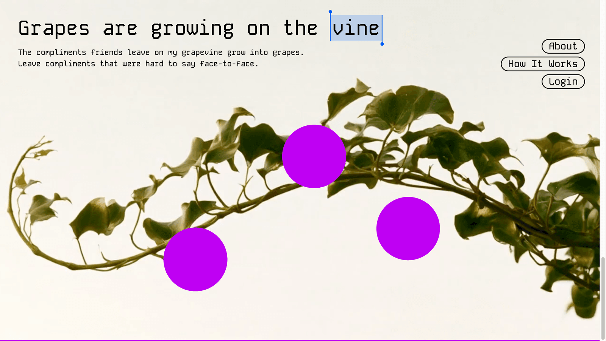
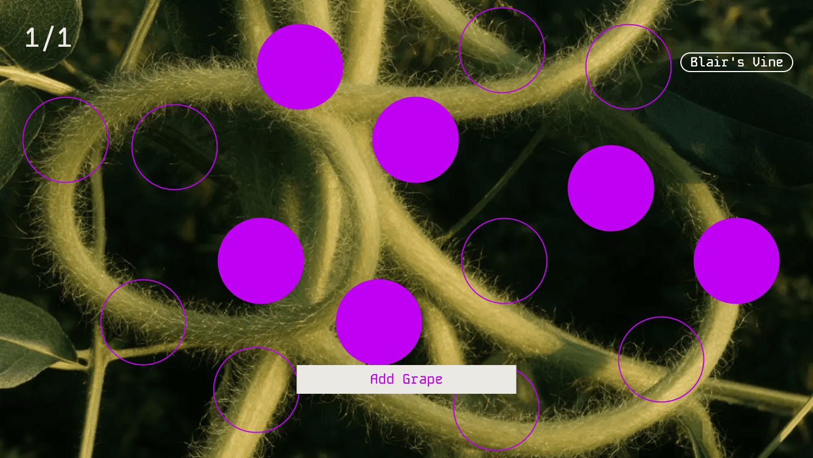
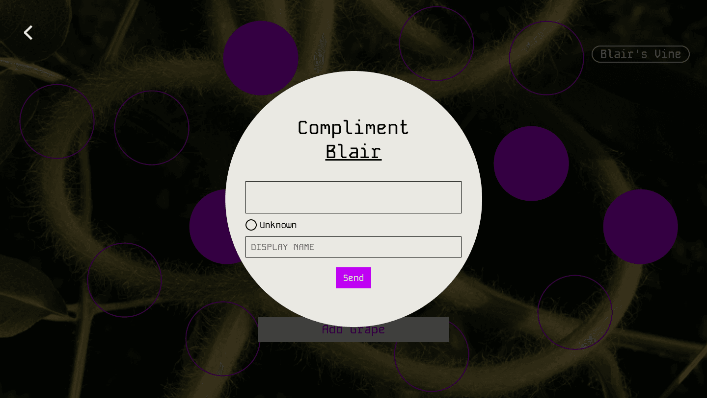
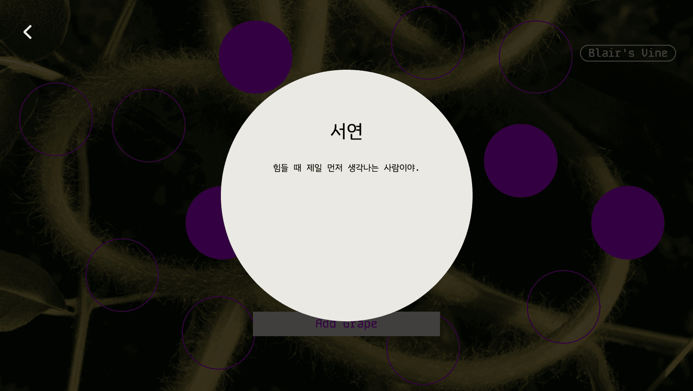
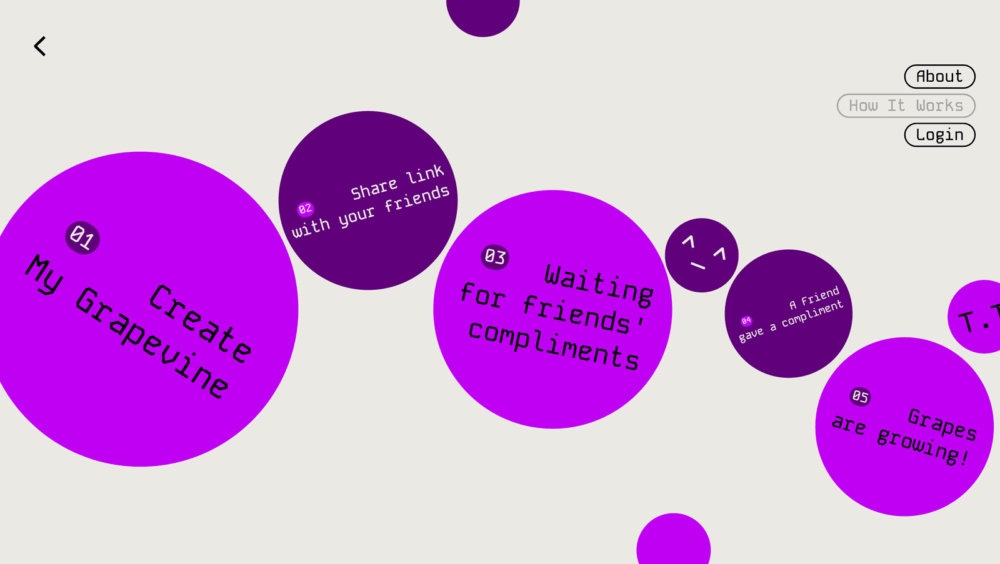
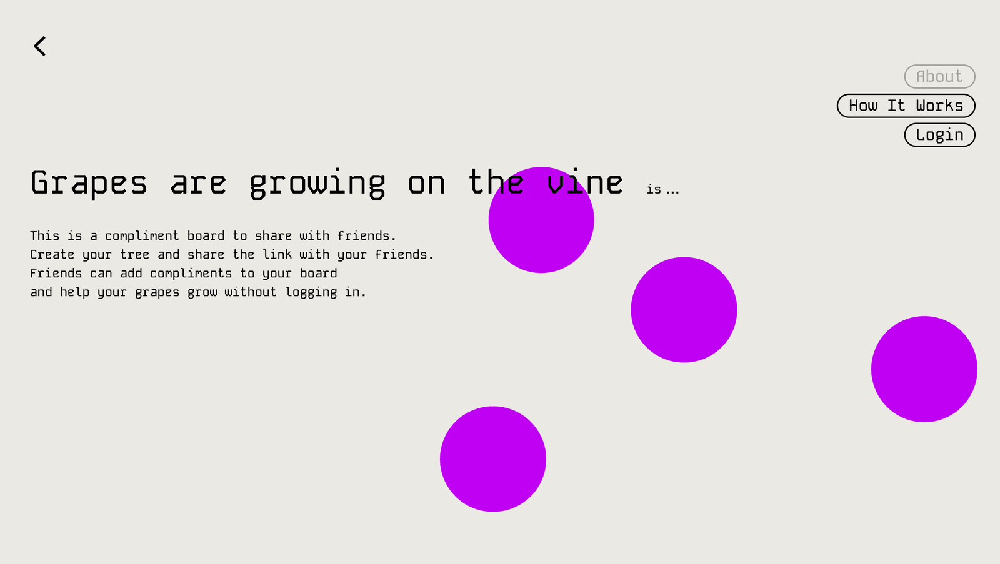
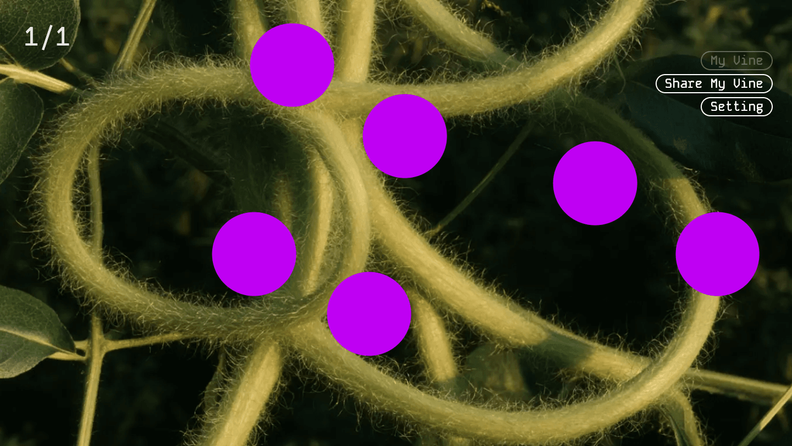
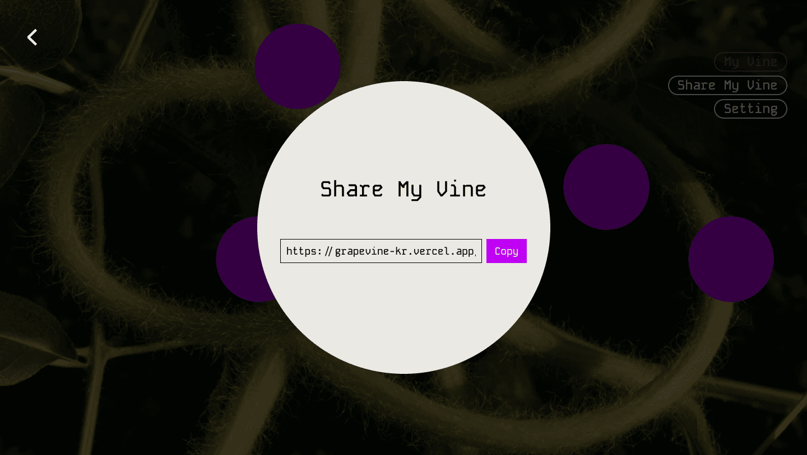
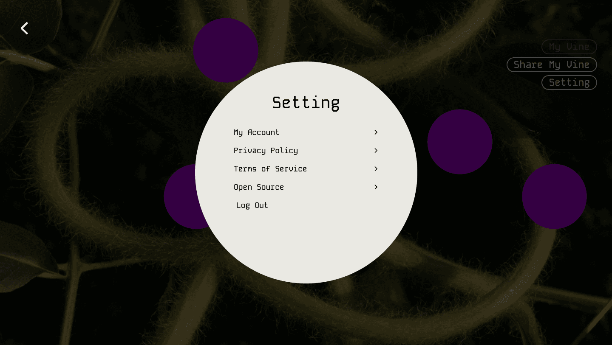

<div align="center">

# GRAPEVINE

**Grapes are growing on the vine.**

친구가 남긴 칭찬이 내 넝쿨에서 포도알로 자란다.
얼굴 보고 하기 어려웠던 말을 링크 하나로 남긴다.

**[열어보기](https://grapevine-kr.vercel.app)** &nbsp;|&nbsp; **[데모 판에 칭찬 남기기](https://grapevine-kr.vercel.app/v/mwd4hm5u8w)**

<sub>데모 판은 로그인 없이 바로 한 알 붙일 수 있다.</sub>

<p>
  
  
  
  
  
  
</p>
<p>
  
  
  
  
</p>



</div>

---

## 무엇을 만들었나

클릭 한 번으로 15알짜리 포도판이 생긴다. 링크를 공유하면 친구는 로그인 없이 빈 알에 이름이나 `Unknown` 과 한 줄 칭찬을 붙인다. 판이 꽉 차면 다음 페이지가 자동으로 생기고 주인은 알을 눌러 읽는다.

| | |
|---|---|
| **방문자 마찰** | 0. 로그인도 가입도 앱 설치도 없다 |
| **판 한 장** | 15알 고정. 좌표는 Figma 시안 그대로 |
| **칭찬** | 80자. 익명 가능 |
| **주인** | 자기 판에는 못 쓴다 |

<table>
<tr>
<td width="33%"><br/><sub><b>1. 링크를 연다</b><br/>빈 알은 아웃라인이고 채운 알은 솔리드다</sub></td>
<td width="33%"><br/><sub><b>2. 칭찬을 붙인다</b><br/>이름을 쓰거나 <code>Unknown</code> 을 고른다</sub></td>
<td width="33%"><br/><sub><b>3. 눌러서 읽는다</b><br/>이름이 제목이 되고 아래에 칭찬이 온다</sub></td>
</tr>
</table>

---

## 이 프로젝트에서 어려웠던 것

기능을 늘리는 대신 이 서비스에만 있는 문제를 제대로 푸는 데 시간을 썼다.

### 1. 두 방문자가 같은 알을 동시에 누른다

링크 공유형이라 동시 접속이 기본값이다. 슬롯 점유를 앱에서 확인하면 확인과 삽입 사이에 남이 끼어든다.

```sql
-- 슬롯은 DB 가 지킨다. 앱 코드가 이걸 대체하지 않는다.
unique (page_id, slot_index)
```

더 까다로운 건 페이지 증설이었다. 13칸이 찬 상태에서 두 요청이 동시에 들어오면 `READ COMMITTED` 라 서로의 미커밋 INSERT 를 못 본다. 둘 다 "14칸, 아직 안 찼다"고 판정하고 커밋한다. 15칸이 다 찼는데 다음 페이지가 영영 안 생긴다.

그래서 RPC 첫 줄이 페이지 행 잠금이다.

```sql
select * from vine_pages where id = p_page_id for update;
```

> 테스트가 통과하는 것만으로는 증명이 안 됐다. 동시성 테스트는 우연히 직렬화되어도 통과한다. 한 세션에서 페이지 행을 `FOR UPDATE` 로 잡아 두고 다른 세션의 RPC 가 실제로 그 줄에서 멈추는지 확인했다.

### 2. 스크럽 영상이 초당 7프레임이었다

스크롤에 영상을 물렸는데 뚝뚝 끊겼다. 용량 26MB 가 원인인 줄 알았는데 재보니 아니었다.

전체 121프레임 중 I-frame 이 1번 하나였다. 브라우저는 `currentTime` 이 바뀌면 직전 키프레임으로 점프해 거기서부터 디코딩한다. 어느 지점으로 스크럽하든 항상 1번 프레임부터 최대 120장을 4060×2040 으로 다시 풀고 있었다.

| Chrome 에서 60개 지점 seek | 중앙값 | p95 |
|---|---:|---:|
| 원본 4060×2040 | **141.9ms** | 257.2ms |
| `-g 1` + 1440폭 | **2.8ms** | 4.0ms |

60fps 예산은 프레임당 16.7ms 다. 원본은 예산의 8.5배를 썼다. 50배 빨라졌고 결정적인 건 해상도가 아니라 `-g 1` 이었다.

### 3. 재보니 폴백이 더 싼 본선이었다

PRD 는 이미지 시퀀스를 iOS 스크러빙이 불안정할 때의 폴백으로 뒀다. 실제로 뽑아서 재보니 시퀀스가 영상보다 작았다.

| | 영상 | WebP 시퀀스 |
|---|---:|---:|
| Main 스크럽 | 2.8MB | **1.22MB** (121장) |
| My Vine 리빌 | 7.8MB | **0.84MB** (11장) |

리빌이 극적이다. 이 연출은 이산 10단계라 화면에 나오는 그림이 11장뿐인데 121프레임짜리 영상을 받아 그중 11장만 보여 주고 있었다. 지금은 영상을 지웠다.

프로브를 안 쓴 이유도 측정에서 나왔다. 재려면 영상을 먼저 받아야 하고 갈아탄 뒤에도 받은 건 못 돌려준다.

### 4. 규칙을 문서가 아니라 구조로 지키기

`video.currentTime` 은 반드시 lerp 로 접근해야 한다. 직접 대입하면 계단처럼 튄다. 소비자마다 lerp 하게 두면 한 곳만 잊어도 규칙이 깨지고 깨진 걸 눈으로만 알 수 있다.

그래서 lerp 를 스크롤 하네스 안에 넣었다. 하네스가 이미 부드러워진 값만 내보내므로 소비자는 잊을 수가 없다.

### 5. 안 보이게만 해 두고 계속 받고 있었다

`prefers-reduced-motion` 에서 CSS 로 영상을 가려 두고 다운로드는 그대로 뒀다. 모션을 끈 사람에게 2.8MB 를 떠넘기는 일이었다.

원인은 하이드레이션 타이밍이었다. `useSyncExternalStore` 는 마크업이 어긋나지 않도록 일부러 서버 값을 돌려주고 effect 는 그 사이에 이미 한 번 돈다. effect 시점에 `matchMedia` 를 직접 읽어 막았다.

그리고 같은 실수를 이미지 시퀀스에서 반복했다. 요청 수를 세지 않았으면 "안 보이니 됐다"로 넘어갔을 결함이다. 이후 모든 연출 검증에 네트워크 요청 수를 넣었다.

### 6. 음수 z-index 는 보여도 마우스가 닿지 않는다

채운 알을 눌러도 아무 일이 없었다. `elementFromPoint` 로 찍어 보니 알이 아니라 `.content` 가 나왔다. 판이 `z-index: -1` 이라 `.content` 박스 뒤로 밀려 있었던 것이다. 알을 눌러 읽는 것은 이 서비스의 절반인데 그게 막혀 있었다.

같은 버그를 How It Works 의 원과 모달의 뒤로가기에서도 찾았다. 뒤로가기는 딤 아래 있어 흐릿하게 비활성처럼 보이고 눌러도 딤이 가로챘다.

### 7. 폰에서는 판이 판이 아니었다

배경이 2:1 인데 세로 화면은 9:19.5 다. `object-fit: cover` 가 가운데 좁은 띠만 남기고 잘라내서 넝쿨은 거대한 줄기 텍스처가 되고 슬롯 좌표는 그 위 아무 데나 떠 있었다.

비율 고정 무대로 바꿨다. 배경과 판을 정확히 같은 상자에 묶고 위아래로 남는 여백에 UI 를 넣는다. 15알이 항상 전부 보이고 항상 넝쿨 위에 앉는다.

---

## 화면

<table>
<tr>
<td width="50%"><br/><sub><b>Main</b><br/>스크롤이 영상을 감는다. 후반부에 포도알이 하나씩 나오고 마지막에 타이틀과 사이드바가 온다</sub></td>
<td width="50%"><br/><sub><b>How It Works</b><br/>마우스가 닿은 원만 제자리에서 흔들린다</sub></td>
</tr>
<tr>
<td><br/><sub><b>About</b><br/>포도알이 떠다니고 커서를 피한다</sub></td>
<td><br/><sub><b>My Vine</b><br/>주인 화면에는 빈 알을 그리지 않는다</sub></td>
</tr>
<tr>
<td><br/><sub><b>Share</b><br/>이 링크가 전부다</sub></td>
<td><br/><sub><b>Setting</b><br/>계정과 문서. 하위 화면에서 뒤로가면 여기로 돌아온다</sub></td>
</tr>
</table>

---

## 구조

```
src/
  app/            라우트와 화면
  models/         도메인 타입
  repositories/   저장소 인터페이스 + Supabase 구현
  services/       유스케이스 (슬롯 선택과 재시도, 방문자 흐름)
  lib/            에러 계층, 스크롤 계산, Supabase 클라이언트
  components/     공용 컴포넌트와 연출 레이어
  styles/         CSS 변수 토큰
  data/           슬롯 좌표, 문구, 연출 타이밍
supabase/migrations/   스키마와 RPC 7개
docs/decisions.md      모든 STEP 의 결정과 이유
scripts/sweep.sh       실서버 기능 점검 65항목
```

데이터 계층은 인터페이스 뒤에 있다. `VineRepository` 가 저장소 원시 연산을 정의하고 Supabase 구현이 그걸 채운다. 슬롯 선택과 충돌 재시도 같은 유스케이스는 서비스 층에 있어서 백엔드를 갈아끼워도 규칙은 그대로 남는다.

값은 코드에 없다. 슬롯 좌표는 `data/slot-layout.ts`, 문구는 `data/copy.ts`, 연출 타이밍은 `data/scroll-cues.ts` 에만 있다. 색과 타이포는 전부 `styles/` 토큰의 `var()` 참조이고 컴포넌트에 하드코딩된 hex 는 0개다.

---

## 검증

눈으로 보고 "되네"로 넘어가지 않으려고 했다. 연출은 눈으로 판별이 안 되는 것들이 많았다.

| | |
|---|---|
| 단위와 통합 테스트 | **116개** (11파일). 도메인 규칙, 동시성, 스크롤 계산 경계 |
| 기능 점검 | **65항목**. 실서버 HTTP 로 핵심 루프와 모든 에러 경로 |
| 브라우저 실측 | 하네스 15, 스크럽 18, 오버레이 11, 리빌 12, 낙하 12, 이미지 시퀀스 9 |

몇 가지 예를 든다.

- **리빌이 정말 이산인가.** 400프레임을 샘플링해 `currentTime` 의 서로 다른 값이 정확히 10개임을 확인했다. 연속 재생이면 수십 개가 나온다. 눈으로는 구분이 안 된다.
- **캔버스가 진행률을 따라가는가.** 32×16 으로 축소해 픽셀 해시를 찍어 비교했다. "그려졌다"가 아니라 "진행률을 따라 그림이 바뀐다"를 봐야 한다.
- **맞는 알이 떨어지는가.** 서버가 배정한 슬롯 번호와 애니메이션이 붙은 슬롯이 같은지 확인했다. 동시 접속이 전제라 틀리면 남의 알이 떨어진다.
- **RLS 가 실제로 막는가.** 빈 테이블이 `[]` 를 반환하는 건 아무것도 증명하지 못한다. 진짜 행을 넣고 공개 키로는 안 보이고 시크릿 키로만 보이는 걸 확인한 뒤 지웠다.

---

## 접근성과 견고함

- 모든 연출에 `prefers-reduced-motion` 정적 폴백이 있다. 미디어를 내려받지도 않는다
- JS 가 없어도 동작한다. 모달은 URL 로 열리고 폼은 네이티브 전송이며 스크롤 연출이 감춘 내용은 `@media (scripting: none)` 으로 드러난다
- 키보드 포커스 표시, 화면마다 `<h1>`, 장식 요소는 `aria-hidden`
- 판은 검색 색인에서 뺐다. "포도밭 둘러보기"는 의도적으로 만들지 않은 기능인데 검색으로 남의 칭찬이 나오면 그게 뒷문으로 생긴다

---

## 만들지 않은 것

판 생성 옵션, QR 공유, 완성 축하 화면, 알림, 익어가는 색 변화, 랭킹, 포도밭 둘러보기, 팔로우, 댓글, 이미지 첨부.

의도적으로 뺐다. 이 서비스는 "링크를 열고 한 줄 남기고 닫는다"가 전부여야 한다.

---

## 로컬에서 실행

```bash
npm install
cp .env.example .env.local      # Supabase URL 과 키를 채운다
npm run dev
```

```bash
npm test              # 단위와 통합 116개
npm run typecheck
npm run build
bash scripts/sweep.sh # 실서버 기능 점검 65항목 (dev 서버가 떠 있어야 한다)
```

`scripts/sweep.sh` 는 계정을 만들고 판을 15칸까지 채운 뒤 스스로 지운다.

---

<div align="center">
<sub>

Next.js (App Router) &nbsp;|&nbsp; TypeScript &nbsp;|&nbsp; CSS Modules &nbsp;|&nbsp; Lenis &nbsp;|&nbsp; Supabase &nbsp;|&nbsp; Vitest

모든 STEP 의 결정과 이유는 [`docs/decisions.md`](docs/decisions.md) 에 있다.

</sub>
</div>
